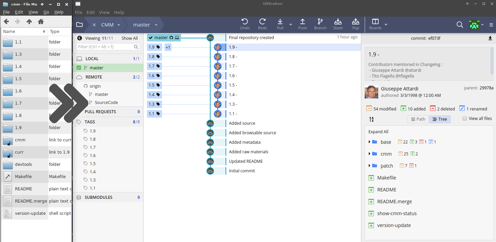
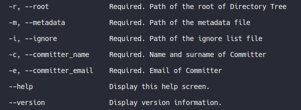

# SWHAP-DT2SG

[](https://travis-ci.com/Unipisa/SWHAP-DT2SG)

Make a synthetic Git from directory tree 
(Directory Tree 2 Synthetic Git).




This project aim to build a tool for reconstructing a Git repository from a directory of source code:
we start from a list of directory, one for each release version, and we create a Git where each directory is a commit.

An [auxillary csv](./metadata_emaple.csv) files is used to specify authors, dates and message commits.
Every directory/file not listed in the auxillary csv is considered as not versioned - it is committed with the last version.

This software comes from the need of [SWHAPPE](https://github.com/Unipisa/SWHAPPE) for [Software Heritage](www.softwareheritage.org).

*The project is still in aplha stage and under development.*

## Usage

```bash
dotnet DT2SG/DT2SG_app.dll -r $path_to_src_root -m $path_to_version_history.csv
```
<!-- 

 -->
## Version History file

The file should contains:

* `directory name`
* `author name` 		name of the main author
* `author email` 		email of the main author (when available)
* `date` 			original date when this commit/version was made
* `curator name` 		name of the curator person or team
* `curator email` 		the reference email of the acquisition process
*  `release tag` 		a tag name if the directory contains a release,	empty otherwise. If equal to `*` then the version is tagged as `directory name`
* `commit message`	


## Warning

The relased version are self-contained (git is not required), but if commits date are pre-1970, git command should be in system path.
