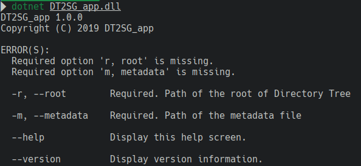

# SWHAP-DT2SG

[](https://travis-ci.com/Unipisa/SWHAP-DT2SG)

Make a synthetic Git from directory tree 
(Directory Tree 2 Synthetic Git).

**Documentation to be updated**




This project aim to build a tool for reconstructing a Git repository from a directory of source code:
we start from a list of directory, - at the moment - one for each release version, and we create a Git where each directory is a commit.

An [auxillary csv](./metadata_example.csv) files is used to specify authors, dates and message commits.
Every directory/file not listed in the auxillary csv is considered as not versioned - it is committed woth the last version.

It born from the need of [DIUNIPI4SWH](https://github.com/Unipisa/DIUNIPI4SWH) for [Software Heritage](www.softwareheritage.org), partially inspired by the [Spinelli](https://www2.dmst.aueb.gr/dds/)`s work onf [unix history repository](https://github.com/dspinellis/unix-history-repo).

*The project is still in aplha stage and under development.*


## Warning

The relased version are self-contained (git is not required), but if commits date are pre-1970, git command should be in system path.

## Usage

```bash
dotnet run --project ./SSGC_app/SSGC_app.fsproj $path_to_src_root
```

on released self-contained versions


```bash
dotnet run DT2SG_app.dll
```

## Build

```bash
dotnet "build" "./SSGC_app/SSGC_app.fsproj" 
```

## Release

Self-contained
```bash
dotnet publish --configuration Release --runtime ubuntu.18.04-x64  /p:PublishSingleFile=true --self-contained true  

dotnet publish --configuration Release --runtime win-x64  /p:PublishSingleFile=true --self-contained true   

dotnet publish --configuration Release --runtime osx.10.11-x64  /p:PublishSingleFile=true --self-contained true   

```

where [wrap-packer](https://github.com/dgiagio/warp) is obtained as follows

```bash
curl -Lo warp-packer https://github.com/dgiagio/warp/releases/download/v0.3.0/linux-x64.warp-packer

chmod +x warp-packer
```